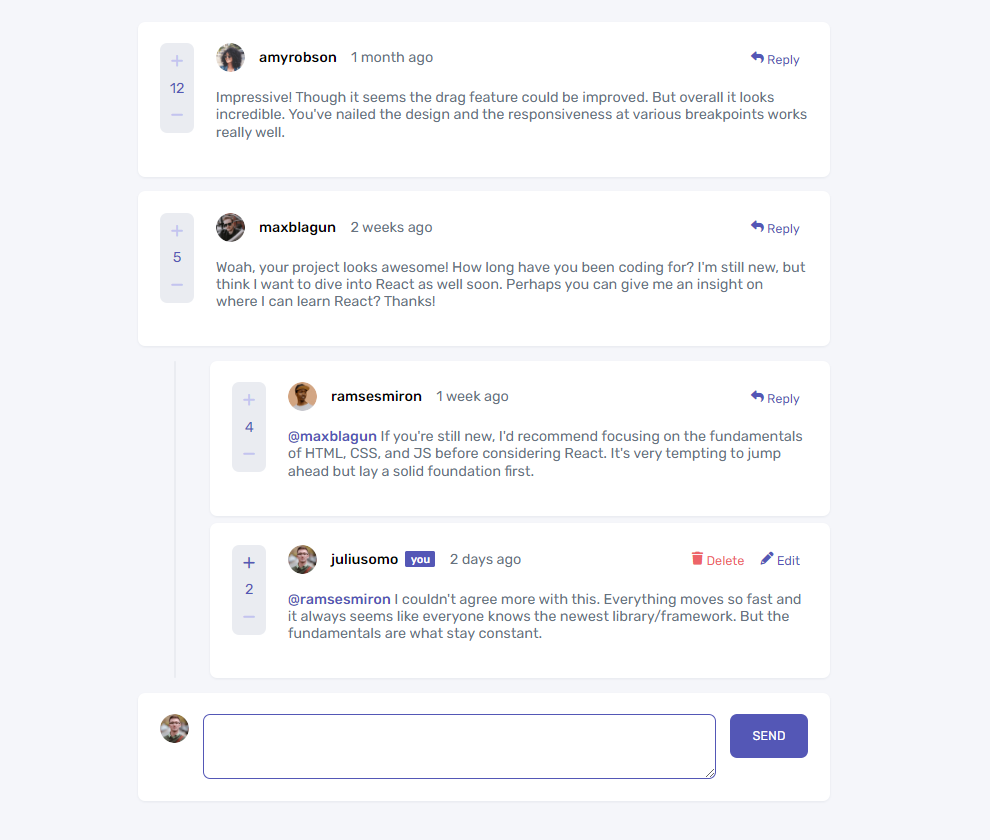

# Interactive Comments Section

This is a solution to the [Interactive comments section challenge on Frontend Mentor](https://www.frontendmentor.io/challenges/interactive-comments-section-iG1RugEG9). Frontend Mentor challenges help you improve your coding skills by building realistic projects.



## Table of contents

- [Overview](#overview)
  - [The challenge](#the-challenge)
  - [Links](#links)
- [My process](#my-process)
  - [Built with](#built-with)
  - [What I learned](#what-i-learned)
  - [Continued development](#continued-development)
- [Author](#author)
- [Setup](#setup)

## Overview

### The challenge

Users should be able to:

- View the optimal layout for the app depending on their device's screen size
- See hover states for all interactive elements on the page
- Create, Read, Update, and Delete comments and replies
- Upvote and downvote comments

### Links

- Repo: [https://github.com/lanaschuster/interactive-comments-section](https://github.com/lanaschuster/interactive-comments-section)
- Live Site URL: [https://luminous-froyo-db642c.netlify.app/](https://luminous-froyo-db642c.netlify.app/)

## My process

### Built with

- Semantic HTML5 markup
- Flexbox
- CSS Grid
- Scss
- [Storybook](https://storybook.js.org/) - for components documentation
- [Vue](https://vuejs.org/) - JS library
- [Vue Test Utils](https://test-utils.vuejs.org/) - for testing
- [Pinia](https://pinia.vuejs.org/) - for state management

### What I learned

- I have learned to use recursive component call, to render the post tree;
- I have learned to use Pinia.

### Continued development

- Keep the posts with localStorage or IndexedDB;
- Add toast to inform the current user about the actions.


## Author

- Linkedin - [Lana Schuster](https://www.linkedin.com/in/lana-schuster-48b896195/)
- Frontend Mentor - [@lanaschuster](https://www.frontendmentor.io/profile/lanaschuster)
- Github - [@lanaschuster](https://github.com/lanaschuster)

## Setup

```
  $ yarn install      // to install dependencies
  $ yarn start        // to start the project in development mode
  $ yarn storybook    // start the storybook


	$ yarn test       	// run jest once
	$ yarn test:watch   // run jest in watch mode
	$ yarn test:ci      // run jest and collect the test coverage


  $ yarn build 	      // to generate the bundle in production mode
```

## Contributing

Issues and Pull requests are welcome ❤️
